# Polyglot Codebase Knowledge Graph

> Generated offline by **readmenator**. Supports C, C++, Python, Go, Rust, JS/TS, Java, C#, Shell, PHP, Dart, GDScript, Nim, ASM.
> No LLMs. No tokens. Pure static analysis.

**Total Files Parsed:** 2 | **Total Symbols Extracted:** 17 | **Total Imports:** 8

## Structural Knowledge Map

```mermaid
graph TD
    classDef mod fill:#1e1e1e,stroke:#ff6666,stroke-width:2px,color:#fff;
    classDef cls fill:#2d2d2d,stroke:#4ec9b0,stroke-width:2px,color:#fff;
    classDef fn fill:#333,stroke:#dcdcaa,stroke-width:1px,color:#dcdcaa;
    classDef ext fill:#111,stroke:#666,stroke-dasharray: 5 5,color:#aaa;
    lazymapd_src_main_rs["main.rs (rs)"]
    class lazymapd_src_main_rs mod;
    lazymapd_src_main_rs_main["main"]
    class lazymapd_src_main_rs_main fn;
    lazymapd_src_main_rs --> lazymapd_src_main_rs_main
    lazymapd_src_main_rs_parse_config["parse_config"]
    class lazymapd_src_main_rs_parse_config fn;
    lazymapd_src_main_rs --> lazymapd_src_main_rs_parse_config
    lazymapd_src_main_rs_parse_port_spec["parse_port_spec"]
    class lazymapd_src_main_rs_parse_port_spec fn;
    lazymapd_src_main_rs --> lazymapd_src_main_rs_parse_port_spec
    lazymapd_src_main_rs_get_top_ports["get_top_ports"]
    class lazymapd_src_main_rs_get_top_ports fn;
    lazymapd_src_main_rs --> lazymapd_src_main_rs_get_top_ports
    lazymapd_src_main_rs_print_banner["print_banner"]
    class lazymapd_src_main_rs_print_banner fn;
    lazymapd_src_main_rs --> lazymapd_src_main_rs_print_banner
    install_sh["install.sh (sh)"]
    class install_sh mod;
    ext_std__net__["std::net::"]
    class ext_std__net__ ext;
    lazymapd_src_main_rs -.->|imports| ext_std__net__
    ext_std__time__Duration["std::time::Duration"]
    class ext_std__time__Duration ext;
    lazymapd_src_main_rs -.->|imports| ext_std__time__Duration
    ext_std__io__["std::io::"]
    class ext_std__io__ ext;
    lazymapd_src_main_rs -.->|imports| ext_std__io__
    ext_std__process["std::process"]
    class ext_std__process ext;
    lazymapd_src_main_rs -.->|imports| ext_std__process
    ext_std__str["std::str"]
    class ext_std__str ext;
    lazymapd_src_main_rs -.->|imports| ext_std__str
    ext_std__fs__File["std::fs::File"]
    class ext_std__fs__File ext;
    lazymapd_src_main_rs -.->|imports| ext_std__fs__File
    ext_rayon__prelude__["rayon::prelude::"]
    class ext_rayon__prelude__ ext;
    lazymapd_src_main_rs -.->|imports| ext_rayon__prelude__
    ext_clap__["clap::"]
    class ext_clap__ ext;
    lazymapd_src_main_rs -.->|imports| ext_clap__
```

---

## Architecture Reference

### RS (1 files)

#### `main.rs`
**Path:** `lazymapd/src/main.rs`

**Enums:**
- `ScanMode` (line 16) - *[derive(Debug, Clone)]*

**Functions:**
- `main` (line 32)
- `parse_config` (line 103)
- `parse_port_spec` (line 172)
- `get_top_ports` (line 197)
- `print_banner` (line 215)
- `run_fast_scan` (line 231)
- `run_detailed_scan` (line 269)
- `grab_banner` (line 310)
- `get_protocol_payload` (line 339)
- `process_response` (line 397)
- `get_service_name` (line 483)
- `print_fast_results` (line 504)
- `print_detailed_results` (line 524)
- `save_fast_results_to_csv` (line 544)
- `save_detailed_results_to_csv` (line 557)

**Structs:**
- `ScanConfig` (line 22) - *[derive(Debug, Clone)]*

### SH (1 files)

#### `install.sh`
**Path:** `install.sh`

*No symbols extracted*
