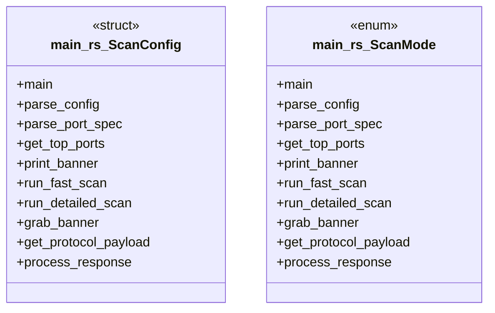

# Polyglot Codebase Knowledge Graph

> Generated offline by **readmenator**. Supports C, C++, Python, Go, Rust, JS/TS, Java, C#, Shell, PHP, Dart, GDScript, Nim, ASM, Ruby, Swift, Kotlin, Scala, Lua, Elixir.
> No LLMs. No tokens. Pure static analysis. See more [here](https://github.com/grisuno/ReadMenator)

**Total Files Parsed:** 2 | **Total Symbols Extracted:** 17 | **Total Imports:** 8

<!-- ranking_model: v1.0 | weights: {ppr:0.45,auth:0.2,test:0.15,doc:0.1,fresh:0.1} | alpha:0.85 | commit:75d209c | date:2026-07-18 -->


## Table of Contents

1. [Statistics Dashboard](#statistics-dashboard)
2. [Architectural Layers](#architectural-layers)
3. [Ranked Context](#ranked-context)
4. [God Nodes](#god-nodes)
5. [Suggested Questions](#suggested-questions)
6. [Hotspot Analysis](#hotspot-analysis)
7. [Change Impact Analysis](#change-impact-analysis)
8. [Suggested Linting Rules](#suggested-linting-rules)
9. [Orphans](#orphans)
10. [Query Recipes](#query-recipes)
11. [Structural Knowledge Map](#structural-knowledge-map)
12. [UML Class Diagram](#uml-class-diagram)
13. [Code Property Graph](#code-property-graph)
14. [Architecture Reference](#architecture-reference)
    - [RS (1 files)](#rs-1-files)
    - [SH (1 files)](#sh-1-files)

---

## Statistics Dashboard

| Metric | Value |
|--------|-------|
| Total Files | 2 |
| Total Symbols | 17 |
| Total Imports | 8 |
| Call Edges | 0 |
| Inheritance Edges | 0 |
| Languages | 2 |
| Avg Symbols/File | 8.5 |
| Avg Imports/File | 4.0 |

### Top Files by Import Count (Fan-Out)

| File | Imports | Symbols | Language |
|------|---------|---------|----------|
| `main.rs` | 8 | 17 | rs |

---

## Architectural Layers

Auto-detected from path patterns, naming conventions, and imported frameworks.

| Layer | Files |
|-------|-------|
| utility | 2 |

### utility

- `install.sh` (sh, 0 symbols)
- `main.rs` (rs, 17 symbols)

---

## Ranked Context

Files ranked by composite score for the current query context. The ranking combines Personalized PageRank (query relevance), global authority, test coverage, documentation coverage, and code freshness. Model: v1.0.

| Rank | File | Composite | PPR | Authority | Test | Doc |
|------|------|-----------|-----|-----------|------|-----|
| 1 | `main.rs` | 0.0118 | 0.0000 | 0.0000 | 0.00 | 0.12 |
| 2 | `install.sh` | 0.0000 | 0.0000 | 0.0000 | 0.00 | 0.00 |

---

## God Nodes

Most architecturally central files ranked by combined import/export degree and symbol richness.

| File | Score | Connections | PageRank |
|------|-------|-------------|----------|
| `main.rs` | 1.7 | | 0.0000 |
| `install.sh` | 0.0 | | 0.0000 |

---

## Suggested Questions

Auto-generated exploration prompts based on graph structure:

- What does main.rs depend on, and what depends on it? (0 connections)
- What does install.sh depend on, and what depends on it? (0 connections)
- What is ScanConfig in main.rs and how is it used?
- What is the overall architecture of this codebase?

---

## Hotspot Analysis

Files ranked by combined complexity (symbol count) and centrality (connection count). High-scoring files are architecturally critical and may need refactoring attention.

| File | Complexity | Centrality | Combined | Symbols | Connections |
|------|-----------|------------|----------|---------|-------------|
| `main.rs` | 1.000 | 1.000 | 1.000 | 17 | 8 |
| `install.sh` | 0.000 | 0.000 | 0.000 | 0 | 0 |

---

## Change Impact Analysis

Files sorted by how many other files would be affected if they changed. High-impact files should be changed with caution.

| File | Direct Dependents | Transitive Dependents | Total Impact |
|------|------------------|----------------------|--------------|
| `install.sh` | 0 | 0 | 0 |
| `main.rs` | 0 | 0 | 0 |

---

## Suggested Linting Rules

Automatically suggested linting and security rules based on patterns detected in the codebase. These can be exported as Semgrep rules using the `--export-rules` flag.

| Rule ID | Severity | Description | Language | Matches |
|---------|----------|-------------|----------|---------|
| `RM001` | info | Large number of functions in rs: 15 total | rs | 15 |

---

## Orphans

Files with no documentation or low connectivity. These are candidates for documentation investment or cleanup.

- `install.sh` (0 symbols, no doc)

---

## Query Recipes

Example queries you can run against this knowledge base using the ranking engine:

```
# Find files most relevant to a concept
readmenator query "Where is the import resolver implemented?"

# Rank files by relevance to a topic
readmenator query "How does documentation generation work?"

# Explain why a file ranks highly
readmenator query "explain readmenator/_documentation.py"

# Trace dependency paths with ranked context
readmenator query "path from CLI to exporter"
```

The ranking model uses the following signals:

- **Personalized PageRank** (45% weight): query-specific relevance via seed propagation
- **Global Authority** (20% weight): structural importance via standard PageRank
- **Test Coverage** (15% weight): fraction of symbols referenced in test files
- **Doc Coverage** (10% weight): presence of docstrings and file-level docs
- **Freshness** (10% weight): recent modification activity

Results include score decomposition and justification paths for each ranked item.

---

## Structural Knowledge Map

```mermaid
graph TD
    classDef mod fill:#1e1e1e,stroke:#ff6666,stroke-width:2px,color:#fff;
    classDef cls fill:#2d2d2d,stroke:#4ec9b0,stroke-width:2px,color:#fff;
    classDef fn fill:#333,stroke:#dcdcaa,stroke-width:1px,color:#dcdcaa;
    classDef ext fill:#111,stroke:#666,stroke-dasharray: 5 5,color:#aaa;
    lazymapd_src_main_rs["main.rs (rs)"]
    class lazymapd_src_main_rs mod;
    lazymapd_src_main_rs_main["main"]
    class lazymapd_src_main_rs_main fn;
    lazymapd_src_main_rs --> lazymapd_src_main_rs_main
    lazymapd_src_main_rs_parse_config["parse_config"]
    class lazymapd_src_main_rs_parse_config fn;
    lazymapd_src_main_rs --> lazymapd_src_main_rs_parse_config
    lazymapd_src_main_rs_parse_port_spec["parse_port_spec"]
    class lazymapd_src_main_rs_parse_port_spec fn;
    lazymapd_src_main_rs --> lazymapd_src_main_rs_parse_port_spec
    lazymapd_src_main_rs_get_top_ports["get_top_ports"]
    class lazymapd_src_main_rs_get_top_ports fn;
    lazymapd_src_main_rs --> lazymapd_src_main_rs_get_top_ports
    lazymapd_src_main_rs_print_banner["print_banner"]
    class lazymapd_src_main_rs_print_banner fn;
    lazymapd_src_main_rs --> lazymapd_src_main_rs_print_banner
    install_sh["install.sh (sh)"]
    class install_sh mod;
    ext_std__net__["std::net::"]
    class ext_std__net__ ext;
    lazymapd_src_main_rs -.->|imports| ext_std__net__
    ext_std__time__Duration["std::time::Duration"]
    class ext_std__time__Duration ext;
    lazymapd_src_main_rs -.->|imports| ext_std__time__Duration
    ext_std__io__["std::io::"]
    class ext_std__io__ ext;
    lazymapd_src_main_rs -.->|imports| ext_std__io__
    ext_std__process["std::process"]
    class ext_std__process ext;
    lazymapd_src_main_rs -.->|imports| ext_std__process
    ext_std__str["std::str"]
    class ext_std__str ext;
    lazymapd_src_main_rs -.->|imports| ext_std__str
    ext_std__fs__File["std::fs::File"]
    class ext_std__fs__File ext;
    lazymapd_src_main_rs -.->|imports| ext_std__fs__File
    ext_rayon__prelude__["rayon::prelude::"]
    class ext_rayon__prelude__ ext;
    lazymapd_src_main_rs -.->|imports| ext_rayon__prelude__
    ext_clap__["clap::"]
    class ext_clap__ ext;
    lazymapd_src_main_rs -.->|imports| ext_clap__
```



---

## UML Class Diagram

Auto-generated Mermaid class diagram from parsed class-level symbols. Shows classes, structs, interfaces, traits, and their methods with inheritance and dependency relationships.



---

## Code Property Graph

Machine-readable Code Property Graph (CPG) in JSON-LD format. This block allows AI agents to parse the full structural graph without additional file reads. Compatible with GraphRAG pipelines.

```json
{"@context": "https://schema.org", "analysis": {"communities": [], "god_nodes": [{"node_id": "lazymapd/src/main.rs", "score": 1.7}, {"node_id": "install.sh", "score": 0.0}], "surprising_connections": []}, "edges": [{"confidence": "EXTRACTED", "relation": "imports", "source": "lazymapd/src/main.rs", "target": "std::net::"}, {"confidence": "EXTRACTED", "relation": "imports", "source": "lazymapd/src/main.rs", "target": "std::time::Duration"}, {"confidence": "EXTRACTED", "relation": "imports", "source": "lazymapd/src/main.rs", "target": "std::io::"}, {"confidence": "EXTRACTED", "relation": "imports", "source": "lazymapd/src/main.rs", "target": "std::process"}, {"confidence": "EXTRACTED", "relation": "imports", "source": "lazymapd/src/main.rs", "target": "std::str"}, {"confidence": "EXTRACTED", "relation": "imports", "source": "lazymapd/src/main.rs", "target": "std::fs::File"}, {"confidence": "EXTRACTED", "relation": "imports", "source": "lazymapd/src/main.rs", "target": "rayon::prelude::"}, {"confidence": "EXTRACTED", "relation": "imports", "source": "lazymapd/src/main.rs", "target": "clap::"}], "generator": "readmenator", "metadata": {"edge_count": 8, "file_count": 2, "language_count": 2, "symbol_count": 17}, "nodes": [{"id": "install.sh", "kind": "module", "label": "install.sh", "language": "sh", "sha256": "c907d80fd6734993", "symbol_count": 0, "symbols": []}, {"id": "lazymapd/src/main.rs", "kind": "module", "label": "main.rs", "language": "rs", "sha256": "5bf70b495f8882d0", "symbol_count": 17, "symbols": [{"kind": "function", "line": 32, "name": "main"}, {"kind": "function", "line": 103, "name": "parse_config"}, {"kind": "function", "line": 172, "name": "parse_port_spec"}, {"kind": "function", "line": 197, "name": "get_top_ports"}, {"kind": "function", "line": 215, "name": "print_banner"}, {"kind": "function", "line": 231, "name": "run_fast_scan"}, {"kind": "function", "line": 269, "name": "run_detailed_scan"}, {"kind": "function", "line": 310, "name": "grab_banner"}, {"kind": "function", "line": 339, "name": "get_protocol_payload"}, {"kind": "function", "line": 397, "name": "process_response"}, {"kind": "function", "line": 483, "name": "get_service_name"}, {"kind": "function", "line": 504, "name": "print_fast_results"}, {"kind": "function", "line": 524, "name": "print_detailed_results"}, {"kind": "function", "line": 544, "name": "save_fast_results_to_csv"}, {"kind": "function", "line": 557, "name": "save_detailed_results_to_csv"}, {"doc": "[derive(Debug, Clone)]", "kind": "struct", "line": 22, "name": "ScanConfig"}, {"doc": "[derive(Debug, Clone)]", "kind": "enum", "line": 16, "name": "ScanMode"}]}], "type": "CodePropertyGraph", "version": "1.0"}
```

---

## Architecture Reference

### RS (1 files)

#### `main.rs`
**Path:** `lazymapd/src/main.rs`

**Enums:**
- `ScanMode` (line 16) - *[derive(Debug, Clone)]*

**Functions:**
- `main` (line 32)
- `parse_config` (line 103)
- `parse_port_spec` (line 172)
- `get_top_ports` (line 197)
- `print_banner` (line 215)
- `run_fast_scan` (line 231)
- `run_detailed_scan` (line 269)
- `grab_banner` (line 310)
- `get_protocol_payload` (line 339)
- `process_response` (line 397)
- `get_service_name` (line 483)
- `print_fast_results` (line 504)
- `print_detailed_results` (line 524)
- `save_fast_results_to_csv` (line 544)
- `save_detailed_results_to_csv` (line 557)

**Structs:**
- `ScanConfig` (line 22) - *[derive(Debug, Clone)]*

### SH (1 files)

#### `install.sh`
**Path:** `install.sh`

*No symbols extracted*
